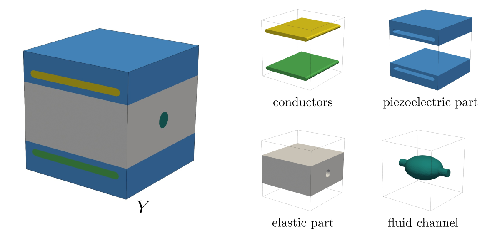
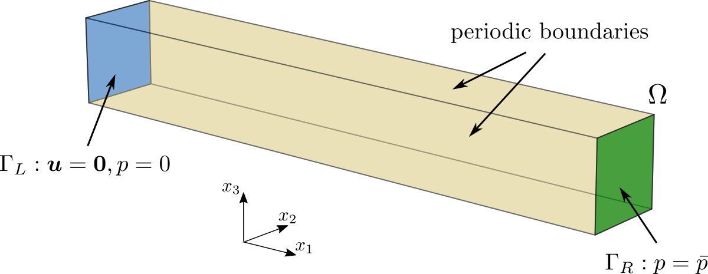
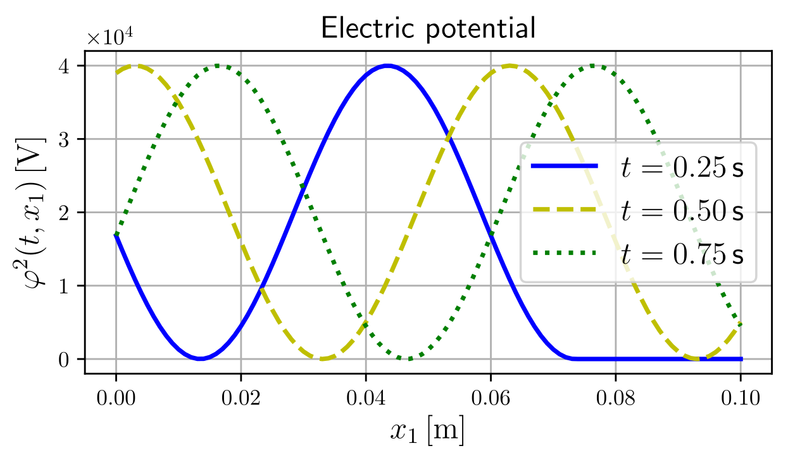
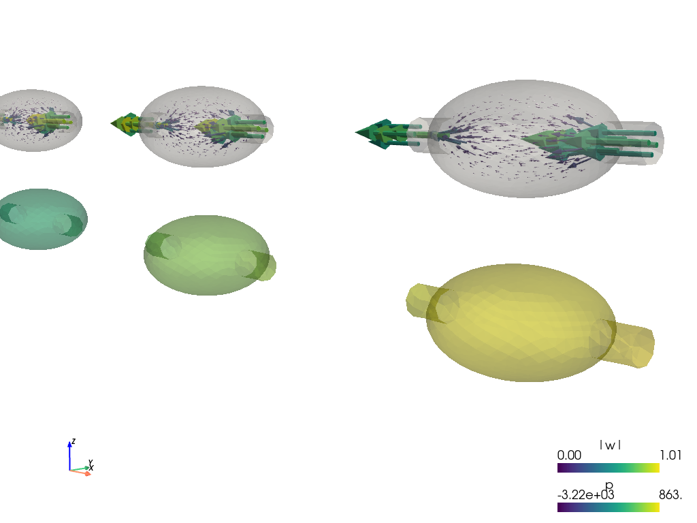
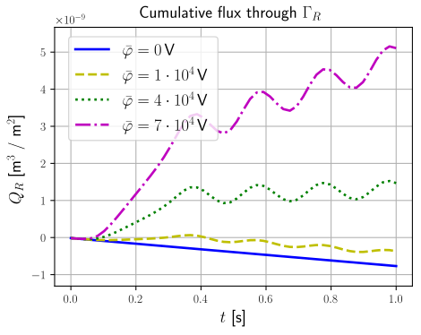

.. toctree::
   :maxdepth: 2
   :caption: Contents:

Homogenization of peristaltic flows in piezoelectric porous media
=================================================================

Model
-----

This example shows the numerical implementation of the homogenized problem of
peristaltic flow in porous piezoelectric materials saturated by electrically
inert fluid. The solid part of a representative volume element consists of the
piezoelectric skeleton with embedded conductors. The pore fluid in the periodic
structure constitutes a single connected domain. The electrodes control the
electric field at the pore level, so that the peristaltic wave of the
deformation influences the pore volume and can control the direction of fluid
flow. For details, see [RohanLukes2023]_.

Implementation
--------------

The homogenized coefficients, their sensitivities, and the microscopic
subproblems are defined in :code:`poropiezo_micro.py` and
:code:`poropiezo_micro_sa.py`. The periodic reference cell, on which the
microscopic subproblems are solved, is depicted in :numref:`fig_micro`.
The FE mesh of the reference cell is stored in :code:`mesh_micro_1D.vtk`.

.. _fig_micro:

   Decomposition of the microscopic reference cell.

The problem description file coding the homogenized macroscopic equations
invokes :code:`poropiezo_macro_nl.py`. The FE mesh related to the macroproblem
is defined in :code:`mesh_macro_20x1x1.vtk`. The applied boundary conditions are shown
in :numref:`fig_macro_bc`, and the prescribed electric potential, inducing
the deformation and thus the fluid flow through the structure, is depicted in
:numref:`fig_macro_phi`.

.. _fig_macro_bc:

   Boundary conditions applied to the macroscopic sample.

.. _fig_macro_phi:

   Electric potential at selected times.

Running simulation
------------------

To run the multiscale numerical simulation, download the
`archive <https://github.com/sfepy/example_piezo_flow/archive/v1.zip>`_,
unpack it and type:

.. code::

   sfepy-run example_piezo_flow-1/piezo_macro_nl.py

In the first step, SfePy invokes the homogenization engine, see
[CimrmanLukesRohan2019]_, which solves the microscopic subproblems and
evaluates the homogenized coefficients required at the macroscopic level. In
the second step, the time-stepping solver resolves the macroscopic problem for
given boundary conditions, and the reconstruction of the displacement,
pressure, and velocity fields at the microscopic level is performed.

The reconstructed pressure and velocity fields are shown in
:numref:`fig_results_rec`. 

.. _fig_results_rec:

   Reconstructed pressure and velocity fields at a given time step.

The above figure was generated by the post-processing script as follows:

.. code::

   sfepy-view output/mesh_micro_1D.recovered_0.001.040_Yf.vtk -f p:o.4:p0 w:g:f5e-4:p1 0:o.4:p1 --camera-position="0.101136,-0.0016623,0.00179498,0.0917673,0.00652579,-0.000337183,-0.1227,0.116262,0.98561"

This simulation demonstrates the ability of the porose piezoelectric structure
to transport fluid against the pressure drop given by the prescribed boundary
pressures. The dependence of the transported fluid on the magnitude of the
electrical potential is depicted in :numref:`fig_results_flux`.

.. _fig_results_flux:

   Dependence of cumulative flux on the amplitude of the prescribed electric potential.

References
----------

.. [RohanLukes2023] Rohan E., Lukeš V.
   Homogenization of peristaltic flows in piezoelectric porous media. Preprint arXiv:2304.05393, 2023,
   `DOI: 10.48550/arXiv.2304.05393 <https://doi.org/10.48550/arXiv.2304.05393>`_

.. [CimrmanLukesRohan2019] Cimrman R., Lukeš V., Rohan E.
   Multiscale finite element calculations in Python using SfePy.
   Advances in Computational Mathematics, 45(4):1897-1921, 2019,
   `DOI:10.1007/s10444-019-09666-0 <https://doi.org/10.1007/s10444-019-09666-0>`_
